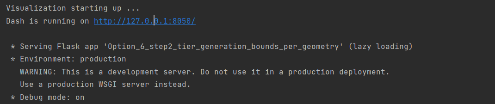
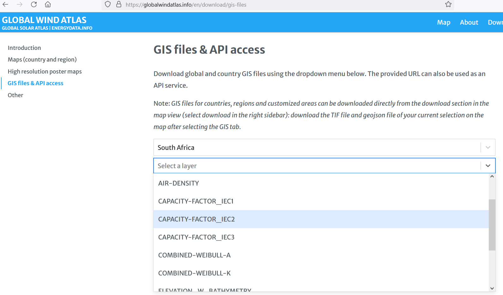
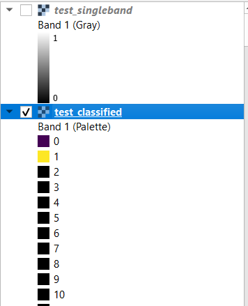
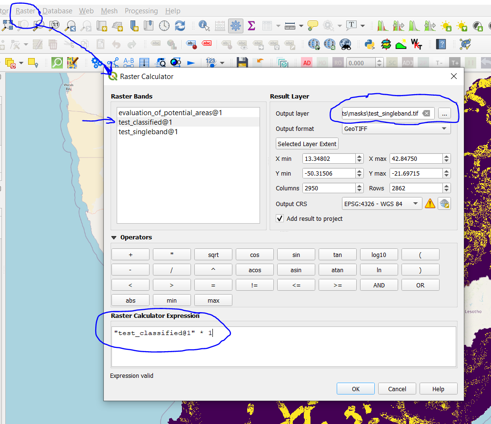

Tier selection and preprocessing toolbox for Irena-Flextool
=============================================================

Tier generation options available:
------------------------------------------------

There are different tier options available:
- Option 1 (dev complete): The user defines an upper percentage limit on the data e.g. I want the upper 10%. Using the averaged Atlite data, this option will find the top certain percentage capacity factors. The corresponding Atlite capacity factor timeseries data is saved as a separate tier. The last tier generated is the average of all the Atlite timeseries found in the upper user defined percentage.
- Option 2:(dev complete): This is the same as Option 1, except that the Wind Atlas data is used to find the location of the upper percentage tiers. Based on these locations, the closest locations in the Atlite data are then used for generating the tiers. 
- Option 3 (dev complete): There are 5 user defined tier bounds. Using the averaged Atlite data, this option will find the bounded percentage band capacity factors for each of those tiers. The timeseries Atlite capacity factor data for each tier bound is averaged in order to generate one timeseries per tier.
- Option 4: This is the same as Option 3, except that the tier bounds are generated from the Wind Atlas data. The locations are then closely matched to the Atlite data and the timeseries are then found. These are averaged to generate one timeseries per tier.
- Option 5: (Two scripts need to be run, geometry creation and tier generation). The user draws their own geometries to indicate tier boundaries. In each of these geometries the Atlite timeseries data is extracted and averaged. Thus giving one timeseries and tier per geometry.
- Option 6: (Two scripts need to be run, geometry creation and tier generation). This is the same as Option 5, except that for each geometry there are multiple tiers. These tiers are based on the tier bounds provided by the user. Note that for point geometries, only one tier is returned.
- Option 7: (User creates function). This function takes tiers and then calculates the new scaled tiers using the Wind Atlas data. The user must provide the function for this.

Scripts:
------------------------------------------------

This tool box consists of the following Python scripts:
- Option 1: Option_1_upper_percentage_atlite.py prepares the capacity factor data from atlite. This will output an averaged over time capacity factor in the assets folder. This code will also find the top certain percentage capacity factor and average these to give you capacity factors you can use (option 1). Option 1A is also bundled in this code and works on bounded tiers. In the .env file there are 5 tiers which the user can choose certain bounds. Dont need to do step 2 or 3 if you are running option 1 or 1A.  
- Option 2: Option_2_upper_percentage_WAD.py (optional, if you already have the geometries in geojson file, for option 2) provides an interactive map interface on your browser which allows the user to select their tiers. A geojson file needs to be exported. using the export button.
- Option 3: Option_3_bound_percentage_atlite.py uses the atlite capacity factors and the designated points and polygons in the geojson file to extract the tiers of capacity factors. This will produce a csv file (option 2) with all the necessary tiers. The last method uses the tiers and allows the user to select the parts of each tier to create the final capacity factors they so wish (option 3).
- Option 4: Option_4_bound_percentage_WAD.py (optional) provides a code stub for the user to correct the Atlite data using
- Option 5: Option_5_step1_geometry_selection.py and Option_5_step2_tier_generation_average_per_geometry.py
- Option 6: Option_6_step1_geometry_selection.py and Option_6_step2_tier_generation_bounds_per_geometry.py
- Option 7: Option_7_WAD_Atlite_correction_user_defined.py

Additionally, there are the Option_Support_Functions.py which are needed for some scripts to run.

Parameters and files that need to be set before running scripts:
--------------------------------------------------------------------

Parameters and variables can be set in the .env file. Or via the command line interface. Here are examples of how they are used for each option:

- Option 1: python Option_1_upper_percentage_atlite.py --ATLITE_DUMMY_DATA True  --DUMMY_START_DATE  '2023-01-01' --DUMMY_END_DATE '2024-01-01'  --DUMMY_LATITUDE_BOTTOM  -32 --DUMMY_LATITUDE_TOP -30  --DUMMY_LONGITUDE_LEFT 26  --DUMMY_LONGITUDE_RIGHT 28   --MAXIMUM_CAPACITY  50  --DATA_VARIABLE_NAME capacity_factors  --TIME_VARIABLE_NAME  time  --AVG_ATLITE_CAPACITY_FACTORS_FILE_LOCATION "assets/avg_atlite_capacity_factors.nc" --AVG_ATLITE_LATITUDE_VARIABLE_NAME latitude --AVG_ATLITE_LONGITUDE_VARIABLE_NAME longitude --PERCENT_UPPER_CAPACITY_FACTORS_1 10  --OPTION_1_OUTPUT_FOLDER  "assets/option_1_output"  --PERCENT_UPPER_CAPACITY_FACTORS_TIME_SERIES_FILE_1  "option_1_top_percentage_capacity_factor_time_series.csv"  --PERCENT_UPPER_CAPACITY_FACTORS_LOCATION_FILE_1  "option_1_top_percentage_locations.csv"  --SCALE_CAPACITY_FACTORS True
- Option 2: python Option_2_upper_percentage_WAD.py --ATLITE_DUMMY_DATA True --DUMMY_START_DATE  '2023-01-01' --DUMMY_END_DATE  '2024-01-01' --DUMMY_LATITUDE_BOTTOM  -32.0 --DUMMY_LATITUDE_TOP  -30.0 --DUMMY_LONGITUDE_LEFT  26.0 --DUMMY_LONGITUDE_RIGHT  28.0 --MAXIMUM_CAPACITY  50 --DATA_VARIABLE_NAME  capacity_factors --TIME_VARIABLE_NAME  time --AVG_ATLITE_CAPACITY_FACTORS_FILE_LOCATION  "assets/avg_atlite_capacity_factors.nc" --AVG_ATLITE_LATITUDE_VARIABLE_NAME  latitude --AVG_ATLITE_LONGITUDE_VARIABLE_NAME  longitude --REDUCED_WAD  True --WIND_ATLAS_RESOLUTION_REDUCTION  15 --WIND_ATLAS_CAPACITY_FACTORS_HEATMAP_FILE_LOCATION  "assets/wind_atlas_capacity_factors.nc" --WIND_ATLAS_HEATMAP_LATITUDE_VARIABLE_NAME  lat --WIND_ATLAS_HEATMAP_LONGITUDE_VARIABLE_NAME  lon --WIND_ATLAS_HEATMAP_DATA_VARIABLE_NAME  Band1 --PERCENT_UPPER_CAPACITY_FACTORS_2  10 --OPTION_2_OUTPUT_FOLDER  "assets/option_2_output" --SCALE_CAPACITY_FACTORS  True --PERCENT_UPPER_CAPACITY_FACTORS_TIME_SERIES_FILE_2  "option_2_top_percentage_capacity_factor_time_series.csv" --PERCENT_UPPER_CAPACITY_FACTORS_LOCATION_FILE_WAD_2  "option_2_top_percentage_locations_wad.csv" --PERCENT_UPPER_CAPACITY_FACTORS_LOCATION_FILE_ATLITE_2  "option_2_top_percentage_locations_atlite.csv"
- Option 3: python Option_3_bound_percentage_atlite.py  --ATLITE_DUMMY_DATA=True  --DUMMY_START_DATE='2023-01-01'  --DUMMY_END_DATE='2024-01-01'  --DUMMY_LATITUDE_BOTTOM=-32.0  --DUMMY_LATITUDE_TOP=-30.0  --DUMMY_LONGITUDE_LEFT=26.0  --DUMMY_LONGITUDE_RIGHT=28.0  --DATA_VARIABLE_NAME=capacity_factors  --TIME_VARIABLE_NAME=time  --AVG_ATLITE_CAPACITY_FACTORS_FILE_LOCATION="assets/avg_atlite_capacity_factors.nc"  --PERCENT_UPPER_TIER1_CAPACITY_FACTORS=0,10  --PERCENT_UPPER_TIER2_CAPACITY_FACTORS=10,20  --PERCENT_UPPER_TIER3_CAPACITY_FACTORS=0,40  --PERCENT_UPPER_TIER4_CAPACITY_FACTORS=60,100  --PERCENT_UPPER_TIER5_CAPACITY_FACTORS=40,60  --AVG_ATLITE_LATITUDE_VARIABLE_NAME=latitude  --AVG_ATLITE_LONGITUDE_VARIABLE_NAME=longitude  --OPTION_3_OUTPUT_FOLDER="assets/option_3_output"  --MAXIMUM_CAPACITY=50  --BOUND_CAPACITY_FACTORS_TIME_SERIES_FILE_3="option_3_top_percentage_capacity_factor_time_series.csv"  --SCALE_CAPACITY_FACTORS=True
- Option 4: python Option_4_bound_percentage_WAD.py  --ATLITE_DUMMY_DATA True  --DUMMY_START_DATE '2023-01-01'  --DUMMY_END_DATE '2024-01-01'  --DUMMY_LATITUDE_BOTTOM -32.0  --DUMMY_LATITUDE_TOP -30.0  --DUMMY_LONGITUDE_LEFT 26.0  --DUMMY_LONGITUDE_RIGHT 28.0 --MAXIMUM_CAPACITY 50  --DATA_VARIABLE_NAME capacity_factors  --TIME_VARIABLE_NAME time  --AVG_ATLITE_CAPACITY_FACTORS_FILE_LOCATION "assets/avg_atlite_capacity_factors.nc"  --AVG_ATLITE_LATITUDE_VARIABLE_NAME latitude  --AVG_ATLITE_LONGITUDE_VARIABLE_NAME longitude  --REDUCED_WAD True  --WIND_ATLAS_RESOLUTION_REDUCTION 15  --WIND_ATLAS_CAPACITY_FACTORS_HEATMAP_FILE_LOCATION "assets/wind_atlas_capacity_factors.nc"  --WIND_ATLAS_HEATMAP_LATITUDE_VARIABLE_NAME lat  --WIND_ATLAS_HEATMAP_LONGITUDE_VARIABLE_NAME lon  --WIND_ATLAS_HEATMAP_DATA_VARIABLE_NAME Band1  --PERCENT_UPPER_TIER1_CAPACITY_FACTORS 0,10  --PERCENT_UPPER_TIER2_CAPACITY_FACTORS 10,20  --PERCENT_UPPER_TIER3_CAPACITY_FACTORS 0,40  --PERCENT_UPPER_TIER4_CAPACITY_FACTORS 60,100  --PERCENT_UPPER_TIER5_CAPACITY_FACTORS 40,60 --AVG_ATLITE_DATA_VARIABLE_NAME capacity_factors  --OPTION_4_OUTPUT_FOLDER "assets/option_4_output"  --SCALE_CAPACITY_FACTORS True  --MAXIMUM_CAPACITY 50  --BOUND_CAPACITY_FACTORS_TIME_SERIES_FILE_4 "option_4_bounded_percentage_capacity_factor_time_series.csv"
- Option 5 (step 1): python Option_5_step1_geometry_selection.py  --ATLITE_DUMMY_DATA True  --DUMMY_START_DATE 2023-01-01  --DUMMY_END_DATE 2024-01-01  --DUMMY_LATITUDE_BOTTOM -32.0  --DUMMY_LATITUDE_TOP -30.0  --DUMMY_LONGITUDE_LEFT 26.0  --DUMMY_LONGITUDE_RIGHT 28.0  --MAXIMUM_CAPACITY 50  --DATA_VARIABLE_NAME capacity_factors  --TIME_VARIABLE_NAME time  --AVG_ATLITE_CAPACITY_FACTORS_FILE_LOCATION "assets/avg_atlite_capacity_factors.nc"  --AVG_ATLITE_LATITUDE_VARIABLE_NAME latitude  --AVG_ATLITE_LONGITUDE_VARIABLE_NAME longitude  --WIND_ATLAS_CAPACITY_FACTORS_PNG_FILE_LOCATION "assets/wind_atlas_capacity_factors.png"  --WIND_ATLAS_PNG_LONGITUDE_LEFT 9.6  --WIND_ATLAS_PNG_LATITUDE_BOTTOM -35.8  --WIND_ATLAS_PNG_LONGITUDE_RIGHT 37.8  --WIND_ATLAS_PNG_LATITUDE_TOP -20.0  --WIND_ATLAS_RESOLUTION_REDUCTION 15  --WIND_ATLAS_CAPACITY_FACTORS_HEATMAP_FILE_LOCATION "assets/wind_atlas_capacity_factors.nc"  --WIND_ATLAS_HEATMAP_LATITUDE_VARIABLE_NAME lat  --WIND_ATLAS_HEATMAP_LONGITUDE_VARIABLE_NAME lon  --WIND_ATLAS_HEATMAP_DATA_VARIABLE_NAME Band1  --MASKS_FOLDER "assets/masks"
- Option 6 (step 2): python Option_5_step2_tier_generation_average_per_geometry.py --AVG_ATLITE_LONGITUDE_VARIABLE_NAME longitude --AVG_ATLITE_LATITUDE_VARIABLE_NAME latitude --AVG_ATLITE_DATA_VARIABLE_NAME capacity_factors --OPTION_5_USER_GEOMETRIES_GEOJSON_FILE "assets/user_geometry/example.geojson" --ATLITE_DUMMY_DATA True  --DUMMY_START_DATE  '2023-01-01' --DUMMY_END_DATE '2024-01-01'  --DUMMY_LATITUDE_BOTTOM  -32 --DUMMY_LATITUDE_TOP -30  --DUMMY_LONGITUDE_LEFT 26  --DUMMY_LONGITUDE_RIGHT 28   --MAXIMUM_CAPACITY  50 --DATA_VARIABLE_NAME capacity_factors  --TIME_VARIABLE_NAME  time --AVG_ATLITE_CAPACITY_FACTORS_FILE_LOCATION "assets/avg_atlite_capacity_factors.nc" --OPTION_5_OUTPUT_FOLDER "assets/option_5_output" --SCALE_CAPACITY_FACTORS True --OPTION_5_OUTPUT_TIERS_FILE "option_5_single_tiers_per_geometry.csv" --OPTION_5_GEOMETRY_REFERENCE_FILE "option_5_geometry_reference_file.csv" --OPTION_5_VIEW_VALID_GEOMETRIES False
- Option 6 (step 1): python Option_6_step1_geometry_selection.py  --ATLITE_DUMMY_DATA True  --DUMMY_START_DATE 2023-01-01  --DUMMY_END_DATE 2024-01-01  --DUMMY_LATITUDE_BOTTOM -32.0  --DUMMY_LATITUDE_TOP -30.0  --DUMMY_LONGITUDE_LEFT 26.0  --DUMMY_LONGITUDE_RIGHT 28.0  --MAXIMUM_CAPACITY 50  --DATA_VARIABLE_NAME capacity_factors  --TIME_VARIABLE_NAME time  --AVG_ATLITE_CAPACITY_FACTORS_FILE_LOCATION "assets/avg_atlite_capacity_factors.nc"  --AVG_ATLITE_LATITUDE_VARIABLE_NAME latitude  --AVG_ATLITE_LONGITUDE_VARIABLE_NAME longitude  --WIND_ATLAS_CAPACITY_FACTORS_PNG_FILE_LOCATION "assets/wind_atlas_capacity_factors.png"  --WIND_ATLAS_PNG_LONGITUDE_LEFT 9.6  --WIND_ATLAS_PNG_LATITUDE_BOTTOM -35.8  --WIND_ATLAS_PNG_LONGITUDE_RIGHT 37.8  --WIND_ATLAS_PNG_LATITUDE_TOP -20.0  --WIND_ATLAS_RESOLUTION_REDUCTION 15  --WIND_ATLAS_CAPACITY_FACTORS_HEATMAP_FILE_LOCATION "assets/wind_atlas_capacity_factors.nc"  --WIND_ATLAS_HEATMAP_LATITUDE_VARIABLE_NAME lat  --WIND_ATLAS_HEATMAP_LONGITUDE_VARIABLE_NAME lon  --WIND_ATLAS_HEATMAP_DATA_VARIABLE_NAME Band1  --MASKS_FOLDER "assets/masks"
- Option 6 (step 2): python Option_6_step2_tier_generation_bounds_per_geometry.py --AVG_ATLITE_LONGITUDE_VARIABLE_NAME longitude --AVG_ATLITE_LATITUDE_VARIABLE_NAME latitude --AVG_ATLITE_DATA_VARIABLE_NAME capacity_factors --PERCENT_UPPER_TIER1_CAPACITY_FACTORS  0,10 --PERCENT_UPPER_TIER2_CAPACITY_FACTORS  10,20 --PERCENT_UPPER_TIER3_CAPACITY_FACTORS  0,40 --PERCENT_UPPER_TIER4_CAPACITY_FACTORS  60,100 --PERCENT_UPPER_TIER5_CAPACITY_FACTORS 40,60 --DATA_VARIABLE_NAME capacity_factors --OPTION_6_USER_GEOMETRIES_GEOJSON_FILE  "assets/user_geometry/example2.geojson" --OPTION_6_OUTPUT_FOLDER "assets/option_6_output"  --ATLITE_DUMMY_DATA True  --DUMMY_START_DATE  '2023-01-01' --DUMMY_END_DATE '2024-01-01'  --DUMMY_LATITUDE_BOTTOM  -32 --DUMMY_LATITUDE_TOP -30  --DUMMY_LONGITUDE_LEFT 26  --DUMMY_LONGITUDE_RIGHT 28   --MAXIMUM_CAPACITY  50  --TIME_VARIABLE_NAME  time --AVG_ATLITE_CAPACITY_FACTORS_FILE_LOCATION "assets/avg_atlite_capacity_factors.nc" --SCALE_CAPACITY_FACTORS True --OPTION_6_OUTPUT_TIERS_FILE  "option_6_multiple_tiers_per_geometry.csv" --OPTION_6_GEOMETRY_REFERENCE_FILE  "option_6_geometry_reference_file.csv"  --OPTION_6_VIEW_VALID_GEOMETRIES False
- Option 7 (user defined): E.G. python Option_7_WAD_Atlite_correction_user_defined.py --WIND_ATLAS_DATA "path/to/WAD"  --ATLITE_DATA "path/to/Atlite/data"

(Postprocessing) Viewing all tiers
-------------------

You can run the view_all_tiers.py script to show all the tiers of all the Options that were generated. These tiers are shown on a web browser interactive graph page.

Notes:
-------

- Note code is sensitive to NaN values, don't have rows or columns that are na or 0's, remove these initial padding columns and rows from your data before running these codes. Or modify the code in the support_functions to read in the data without these missing values.
- Option 1, 2,3 and 4 (and 7) don't require user input on a browser. Options 5 and 6 require the user input on a browser.
- All relevant Python packages are found in requirements.txt (I may be missing some :-)) 
- Make sure to copy the sample.env to an .env file. This .env file, which contains all the user settings, is the user settings. Rather not change the assets folder. Keep that as is. The file names you can change as you need. Edit this file to configure the preprocessing scripts.
- Too high a resolution is not a good idea for the world atlas netcdf data, this will significantly increase the rendering time.
- Only single band (not classified) .tif files used as masks, make sure they each have an extent. You can add as many as you want in the masks folder. A method is described in this readme on how to convert a classified raster to a single band raster.
- Please give step 1 for Option 5 and 6 some time before loading the map on the browser, it can take a while to read in the mask files. Dueto dash initially loading, it loads the data twice to ensure the cache is fulfilled, so please be patient!
- The scripts for step 2 in Options 5 and 6, has a variable, OPTION_5_VIEW_VALID_GEOMETRIES and OPTION_6_VIEW_VALID_GEOMETRIES, which enables the user to visualize the map and geometries in the browser. The link to the page is shown in the console output as per example of this picture 

(Preprocessing) Wind Atlas Data preprep
---------------------------

- Before using the Wind Atlas data (netcdf file), it needs to be downloaded and saved to the assets folder. Youcan download a dataset from here:
- https://globalwindatlas.info/en/download/gis-files
- )
- Download the tif file.
- You will need gdal or qgis installed to process the wind atlas data tif file to netcdf. 
- To do this in gdal: 
- 1) Convert your tif file into a proper geotif file with a 2 dimensional layer using:
- gdal_translate -b 1 -of GTiff D:\tempDownloads\ZAF_capacity-factor_IEC1.tif D:\tempDownloads\temp.tif
- Translate the file into a netcdf file:
- gdal_translate -of NetCDF -co "FORMAT=NC4" -a_nodata nan -a_srs EPSG:4326 -mo "Minimum=0.0185328294" -mo "Maximum=0.6504413486" D:\tempDownloads\temp.tif D:\tempDownloads\output.nc
- 2) If you are using qgis, open the python console (Plugins --> Python Console) and run these commands (be sure to change the input_tif,temp_tif,output_nc file names, temp can be anything):
  - import os 
  - from osgeo import gdal
  - input_tif = '/path/to/input.tif'
  - temp_tif = '/path/to/temp.tif'
  - output_nc = '/path/to/output.nc'
  - input_ds = gdal.Open(input_tif)
  - band = input_ds.GetRasterBand(1)
  - array = band.ReadAsArray()
  - cols = input_ds.RasterXSize
  - rows = input_ds.RasterYSize
  - driver = gdal.GetDriverByName('GTiff')
  - output_ds = driver.Create(temp_tif, cols, rows, 1, band.DataType)
  - output_ds.GetRasterBand(1).WriteArray(array)
  - output_ds.SetGeoTransform(input_ds.GetGeoTransform())
  - output_ds.SetProjection(input_ds.GetProjection())
  - output_ds = None
  - input_ds = None 
  - gdal.Translate(output_nc, temp_tif, format='NetCDF', outputSRS='EPSG:4326',creationOptions=['FORMAT=NC4'])
  - os.remove(temp_tif)

(Preprocessing) Wind Atlas Data PNG preprep
---------------------------

- To get the png pic that works, use qgis, style the map accordingly, and click project then import/export then export map to image.
- Play with the bounds for the image (found in the .env file) so that it fits on the south african boarder.
- User can then select the tiers according to the world atlas capacity factors if they so wish.
- To obtain the netcdf file, use qgis to save the tiff as a netcdf file.

(Preprocessing) Masks preparation
------------------

As noted, only single band (not classified) .tif files used as masks, make sure they each have an extent. You can add as many as you want in the masks folder. A method is described in this readme on how to convert a classified raster to a single band raster.

If you have a classified tiff file and want to convert it to a single band then you can use QGIS.

- Open QGIS and load the classified tiff layer
- Open the raster calculater (raster --> raster calculator) and perform the calculation "classified_raster_band@1" * 1.
- Save it into a new tiff file
- Use this new singleband tiff file as your mask in the assets/masks folder

Please remove all classified masks (or rename the extension) from the assets/masks folder so that it doesnt load them, this is to save you some run time.

Assumptions
-------------------

- For points geometry selection, the nearest timeseries datapoint is found and selected

Authors:
---------
- Kirodh Boodhraj
